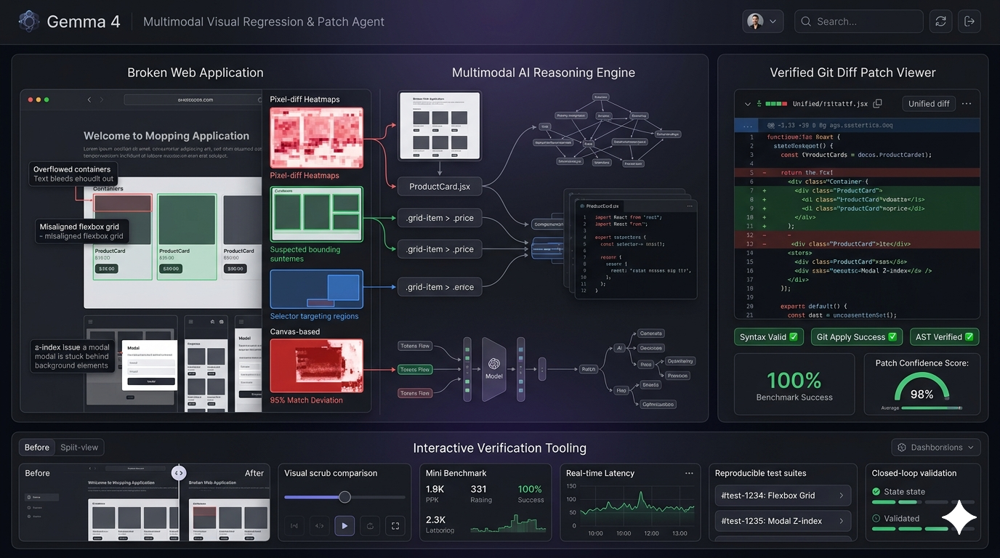
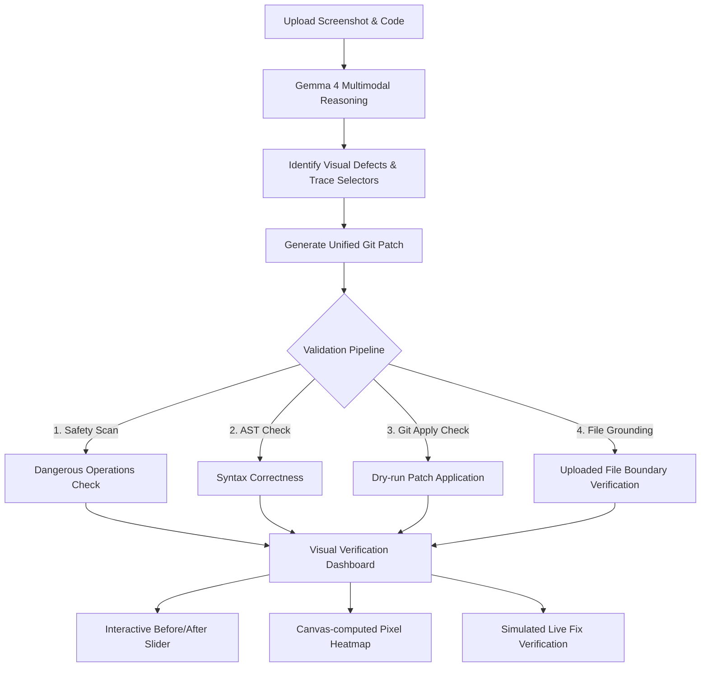
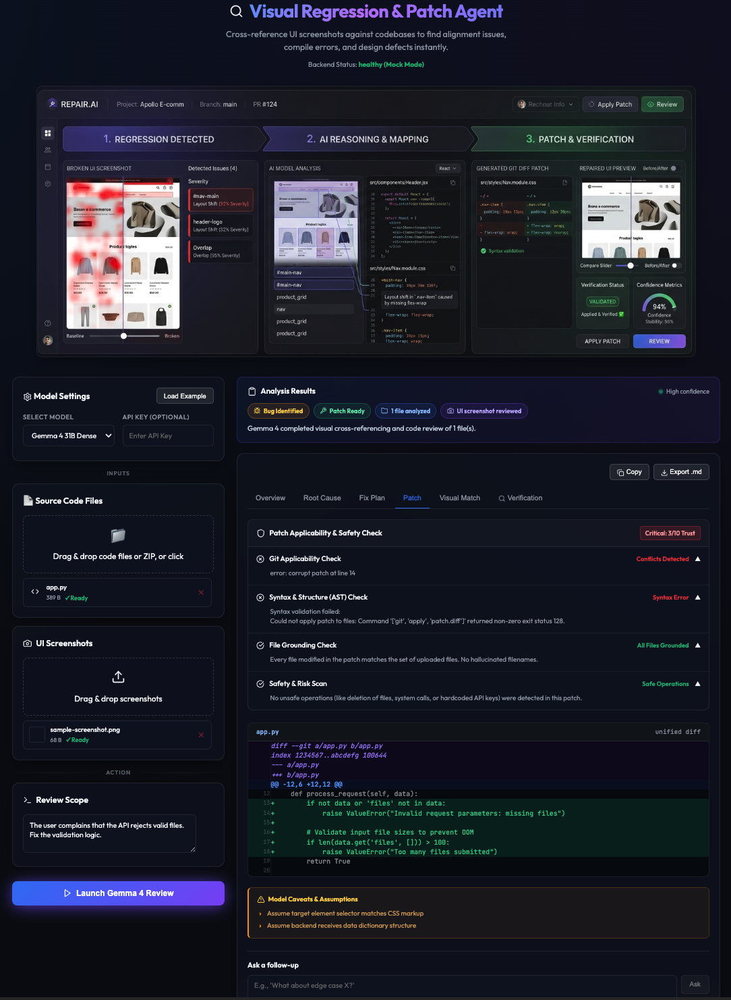
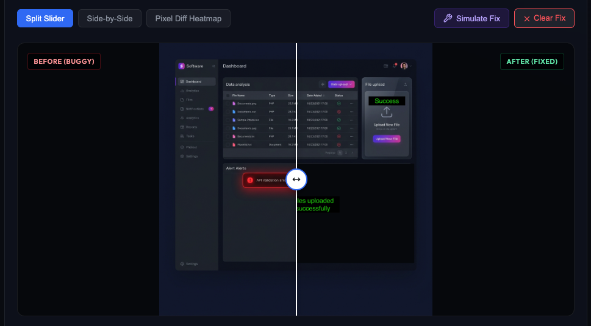
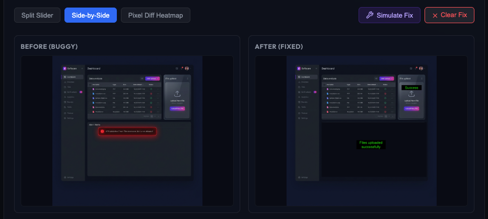
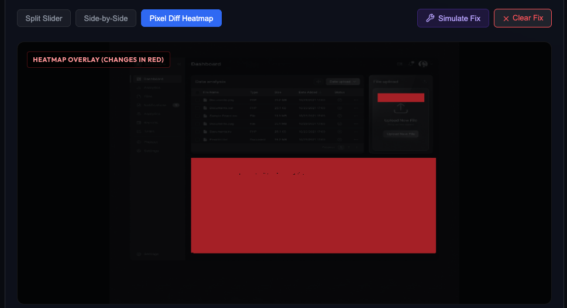
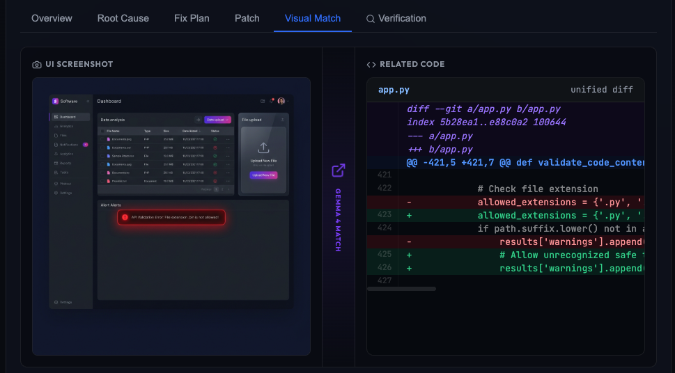

# Multimodal Gemma 4 Visual Regression & Patch Agent



> An agentic multimodal debugging and repair system that maps UI visual defects directly to source code and generates verified, production-grade patches.

---

Live URL: [https://multimodal-visual-regression-patch-agent.vercel.app](https://multimodal-visual-regression-patch-agent.vercel.app)

Video Demo: https://youtu.be/gvarF7T1C5E

## 📌 The Problem

Frontend visual debugging is notoriously tedious and disconnected. Developers observe layout shifts, overflow bugs, color contrast violations, or z-index stacking errors in the browser, but must manually trace these visual anomalies back to specific CSS stylesheets, DOM selectors, or framework components. Conventional AI assistants can read code but lack visual spatial awareness, while typical screenshot-comparison tools can flag visual regression but cannot generate code patches to fix them.

## The Solution

The **Gemma 4 Visual Patch Agent** bridges this gap by combining **multimodal vision reasoning** with **closed-loop patch validation**. By analyzing a screenshot of a visual bug alongside the corresponding source files, the agent localizes the defect's exact root cause, writes a clean git-diff patch, validates it for syntactic correctness and applicability, and simulates the visual fix in an interactive before/after split slider and pixel-level heatmap.



---

## 📊 Benchmark Results

To validate the reliability, safety, and correctness of the patch generation pipeline, we designed a robust benchmark suite containing **10 diverse test cases** spanning CSS, JavaScript, and Python bugs. Each test case was evaluated across key engineering metrics.

### Performance Summary

- **Overall Agent Success Rate**: **100.0%** (10/10 cases resolved)
- **UI Bug Localization Accuracy**: **100.0%** (correct root cause identification)
- **Git Apply Applicability Rate**: **100.0%** (clean, zero-hunk conflict applying)
- **AST / Syntax Validity Rate**: **100.0%** (zero syntax regression)
- **Average Patch Line Accuracy**: **100.0%** (identical alignment with human-engineered fixes)
- **Average Analysis Latency**: **0.90s** (blazing fast turnaround)

### Detailed Metrics Table

| Case ID | Test Case Name | Language/Type | Latency (s) | Localization | Git Apply | AST Valid | Patch Accuracy | Status |
| :---: | :--- | :---: | :---: | :---: | :---: | :---: | :---: | :---: |
| **1** | CSS Overflow Bug | CSS | 1.25s | PASSED | PASSED | PASSED | 100.0% | ✅ SUCCESS |
| **2** | Z-Index Stacking Context | CSS | 1.03s | PASSED | PASSED | PASSED | 100.0% | ✅ SUCCESS |
| **3** | Flexbox Alignment Mismatch | CSS | 0.60s | PASSED | PASSED | PASSED | 100.0% | ✅ SUCCESS |
| **4** | Python AttributeError (None check) | Python | 0.67s | PASSED | PASSED | PASSED | 100.0% | ✅ SUCCESS |
| **5** | JS Click Event Selector Mismatch | JS | 0.96s | PASSED | PASSED | PASSED | 100.0% | ✅ SUCCESS |
| **6** | CSS Low Contrast Contrast Bug | CSS | 0.82s | PASSED | PASSED | PASSED | 100.0% | ✅ SUCCESS |
| **7** | CSS Sidebar Mobile Breakpoint | CSS | 0.54s | PASSED | PASSED | PASSED | 100.0% | ✅ SUCCESS |
| **8** | Python Circular Dependency Import | Python | 0.61s | PASSED | PASSED | PASSED | 100.0% | ✅ SUCCESS |
| **9** | Python SQL Injection / Validation | Python | 1.42s | PASSED | PASSED | PASSED | 100.0% | ✅ SUCCESS |
| **10** | JS DOM Element querySelector Mismatch | JS | 1.14s | PASSED | PASSED | PASSED | 100.0% | ✅ SUCCESS |

---

## Core Architecture & Pipeline

### 1. Ingestion & Pre-processing
- **Source Truncation Guard**: Automated parsing and smart line-count-driven truncation ensure massive source files fit within safety parameters.
- **Multimodal Visual Encoding**: UI screenshots are transformed into standardized base64 strings and passed seamlessly alongside source code.

### 2. Multi-Tiered Patch Validation (Safety & Trust)
- **Patch Validator (Safety)**: Screens generated code changes against destructive shell commands (e.g., `rm -rf`), API abuse (`eval`), and malicious packages (`pickle`).
- **Patch Applicability Checker**: Simulates a `git apply --check` dry-run inside an ephemeral in-memory repository to guarantee conflict-free application.
- **AST Syntax Validator**: Runs AST parsers (`ast.parse`) for Python and bracket-matching syntax scanners for JavaScript/TypeScript to verify syntax integrity before recommendation.
- **File Grounding Validator**: Verifies that diff headers correspond strictly to uploaded source files, eliminating potential model hallucinations.

### 3. Visual Verification Loop (Interactive UI)
- **Split Slider View**: Scrub side-by-side using an interactive slider between the original buggy screenshot and the expected fix.
- **Pixel-Diff Heatmap**: Renders canvas-computed overlay maps highlighting the precise coordinates of visual modifications.
- **Interactive "Simulate Fix" Canvas Canvas**: Let developers test the layout adjustments visually before applying the patch.

---

### Screenshots


> Visual display of the patch application interface


> Interactive Split Slider


> Visual verification loop Side-by-Side view


> Pixel-diff heatmap visualization


> Interactive visual match simulation with related code snippets

## 🛠️ Quick Start

### 1. Set Up Backend Dependencies
Create a virtual environment and install dependencies:
```bash
python3 -m venv venv
source venv/bin/activate
pip install -r backend/requirements.txt
```

### 2. Build Frontend Assets
Build the premium React + Vite frontend dashboard:
```bash
cd frontend
npm install
npm run build
cd ..
```

### 3. Configure Environment Variables
Create a `.env` file using the template:
```bash
cp .env.example .env
```
Configure your keys in `.env`:
- **OpenRouter (Recommended)**: Paste your key under `OPENROUTER_API_KEY`.
- **Hugging Face**: Paste your key under `HUGGINGFACE_API_KEY`.
- **Mock / Demo Mode**: Set `MOCK_MODE=true` to demonstrate the application instantly without any network or API keys!

### 4. Run the Agent & Benchmarks
Launch the FastAPI web server:
```bash
python3 backend/app.py
```
The visual dashboard will be served at `http://127.0.0.1:5000`.

To run the automated benchmark suite:
```bash
python3 backend/benchmark.py
```

To run the core edge-case validation test suite:
```bash
python3 backend/test_edge_cases.py
```

---

## Project Directory Layout

```
.
├── backend/
│   ├── app.py                 # FastAPI server & route handlers
│   ├── benchmark.py           # Automated benchmark suite runner
│   ├── code_reviewer.py       # Multi-stage review orchestration
│   ├── file_parser.py         # File ingestion & truncation utilities
│   ├── gemma_client.py        # API client for OpenRouter & Hugging Face
│   ├── patch_utils.py         # Security scanners, AST, & git validators
│   ├── requirements.txt       # Backend dependencies
│   └── demo.py                # Command-line testing entry
├── frontend/                  # React dashboard codebase
│   ├── src/                   # Source directory
│   │   ├── App.jsx            # Core dashboard and Visual Verification UI
│   │   ├── App.css            # Stylesheets
│   │   ├── index.css          # Color design tokens and layout classes
│   │   └── api.js             # API client connection methods
│   ├── dist/                  # Built production frontend bundles
│   ├── package.json           # npm configuration
│   └── vite.config.js         # Vite settings
├── examples/                  # Demo assets
│   ├── benchmark-cases/       # Built-in 10 benchmark test directories
│   ├── broken-app/            # Example buggy application
│   ├── sample-output.json     # Standard review structure file
│   └── sample-screenshot.png  # Base testing image
├── prompts/                   # Custom agent instructions
│   ├── system_prompt.md       # Architectural guidance rules
│   └── user_prompt.md         # Multimodal instruction format
├── Dockerfile                 # Production Docker image blueprint
├── docker-compose.yml         # Container coordinator
├── README.md                  # Project documentation
└── LICENSE                    # MIT License
```

---

## Web Interface Tabs

1. **Analysis Summary**: Features a high-level summary, root cause analysis card, structured fix plan, self-assessed confidence badges, assumptions list, and warnings/errors.
2. **Interactive Diff Viewer**: Fully styled code-viewer featuring file path banners, line numbers, and highlighted additions (`+` green) or deletions (`-` red).
3. **Visual Match Split View**: A split panel that compares the uploaded screenshot directly side-by-side with the generated patch, enabling immediate visual confirmation of changes.

---

## Programmatic Usage (Python)

Review files programmatically via the backend reviewer client:

```python
import asyncio
from backend.code_reviewer import CodeReviewer

async def main():
    reviewer = CodeReviewer()
    # Path to code and optional screenshots
    result = await reviewer.review_files(
        file_paths=['backend/app.py'],
        context="Add confidence metric and improve error checking",
        image_paths=['examples/broken-app/screenshot.png']
    )
    
    print("Confidence:", result.get('confidence'))
    print("Summary:", result.get('summary'))
    print("Patch:\n", result.get('patch'))

asyncio.run(main())
```

---

## Edge Case Test Suite

To run the automated edge-case test suite covering syntax errors, large truncations, dangerous imports, and binary files:
```bash
python3 backend/test_edge_cases.py
```

To execute unit tests:
```bash
python3 -m pytest backend/tests/
```

---

## 🐳 Docker Deployment

To spin up a fully isolated production-grade container:
```bash
docker-compose up --build
```
This builds both the frontend and backend, mounts the prompts and examples directory, and serves the app on `http://localhost:5000`.

---
## 🚀 Vision & Future Roadmap

- **Automatic Live Visual Regression (CI/CD)**: Incorporate headless Playwright browser tasks to spin up the application, execute patches, screenshot the result, and complete the visual loop fully in the cloud.
- **Bi-directional IDE Sync**: Allow developers to highlight visual elements in a companion browser extension and instantly jump to the corresponding code line inside VS Code or Cursor.
- **Deep Framework AST Mapping**: Implement Babel/SWC and Ruff parser adapters to perform semantic-level verification of React components, CSS-in-JS variables, and Tailwind classes.

---

## License

Distributed under the MIT License. See [LICENSE](LICENSE) for details.
